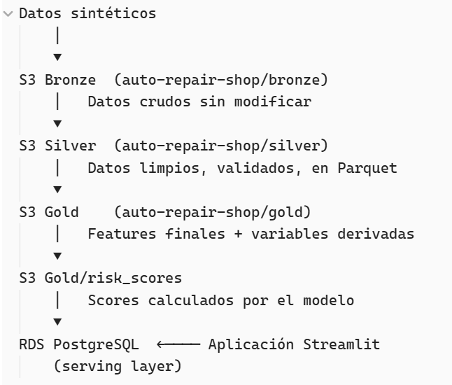
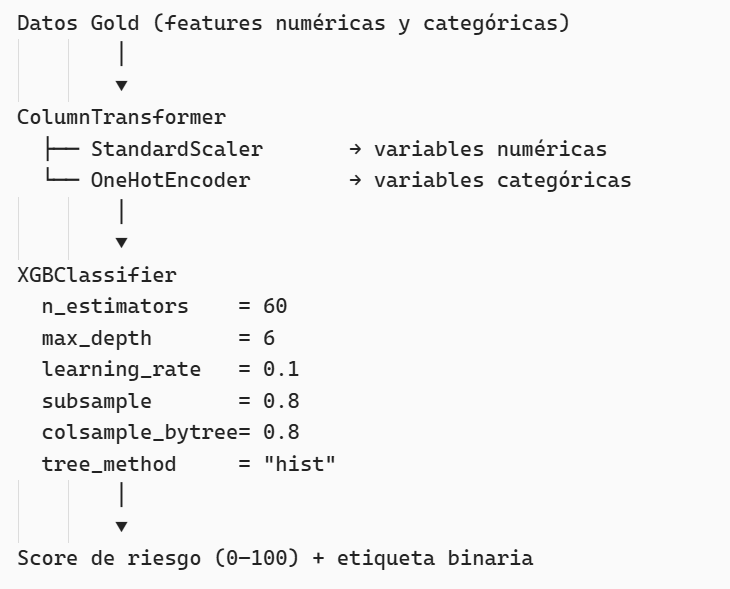
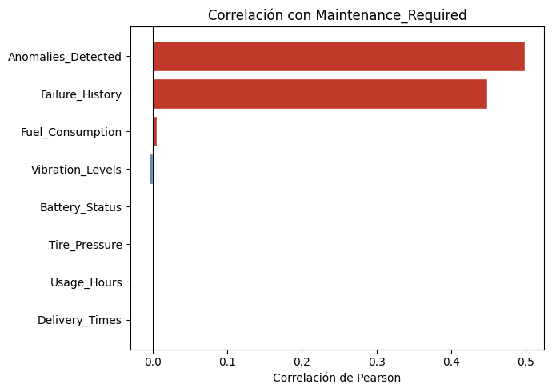
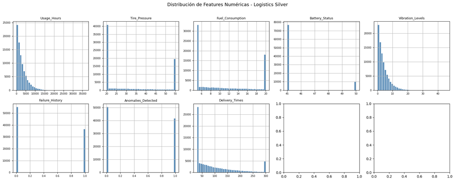
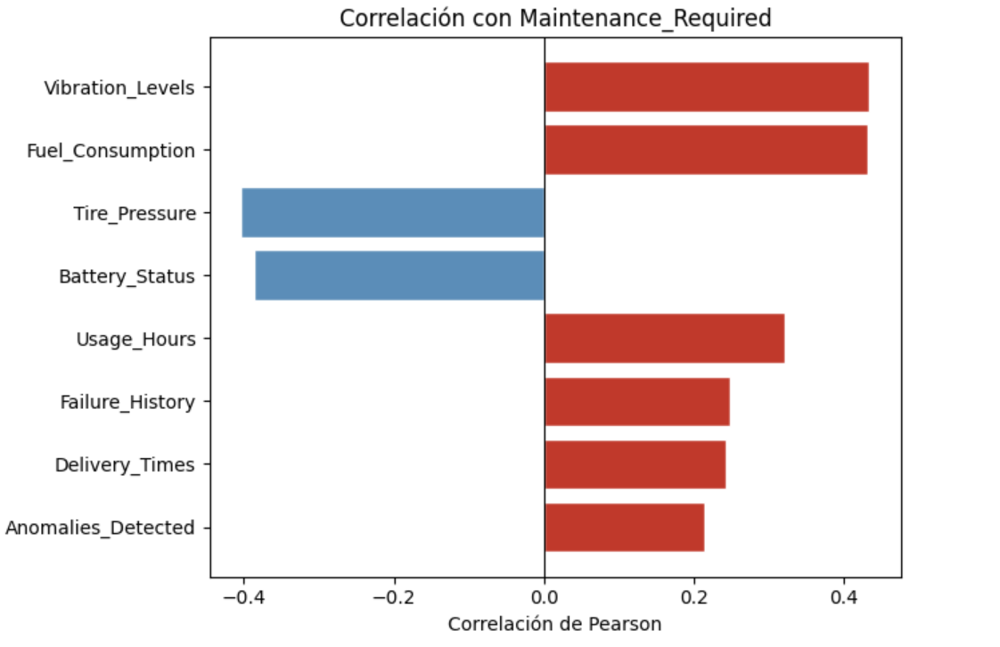
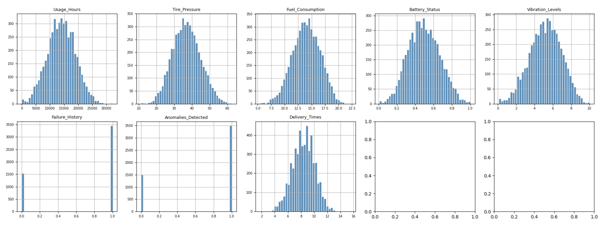
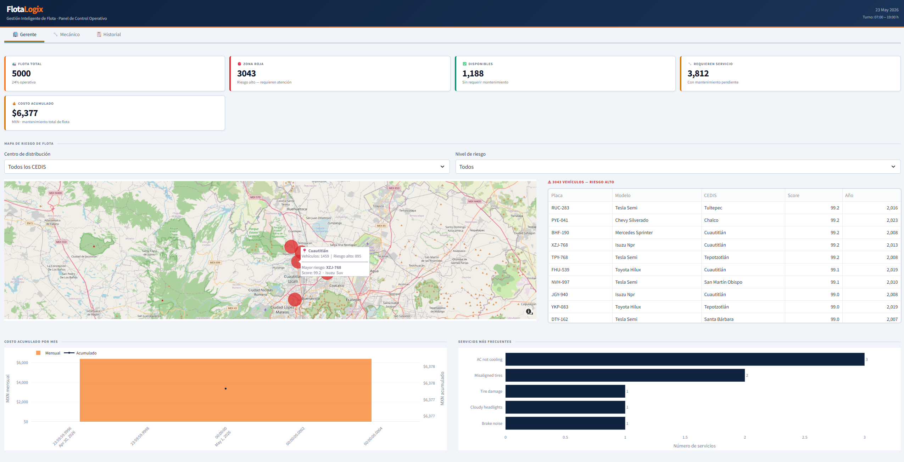
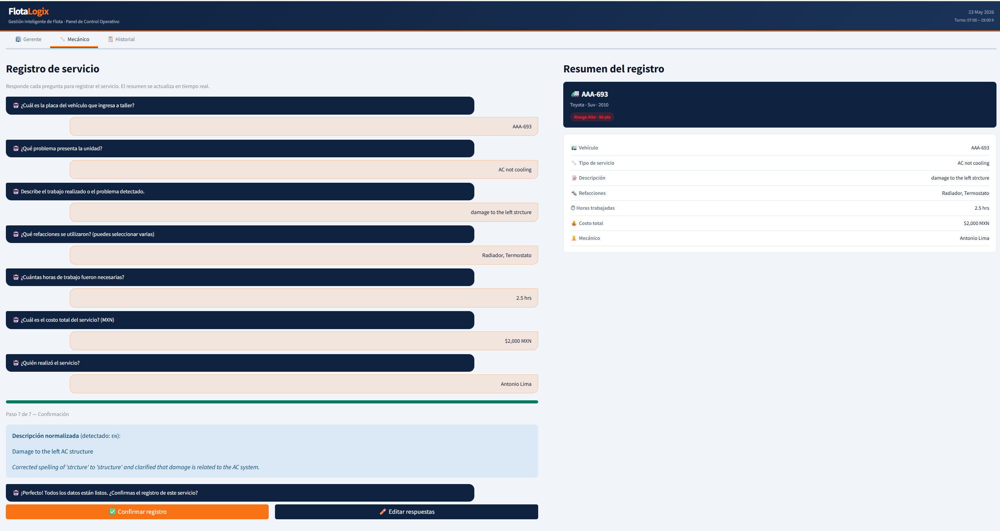
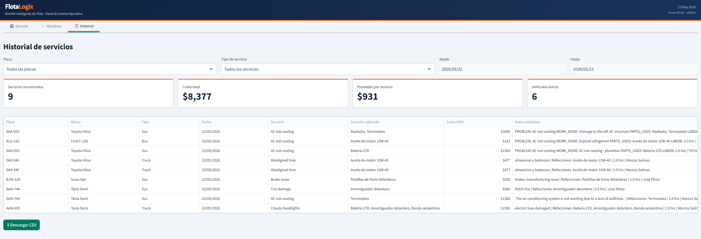
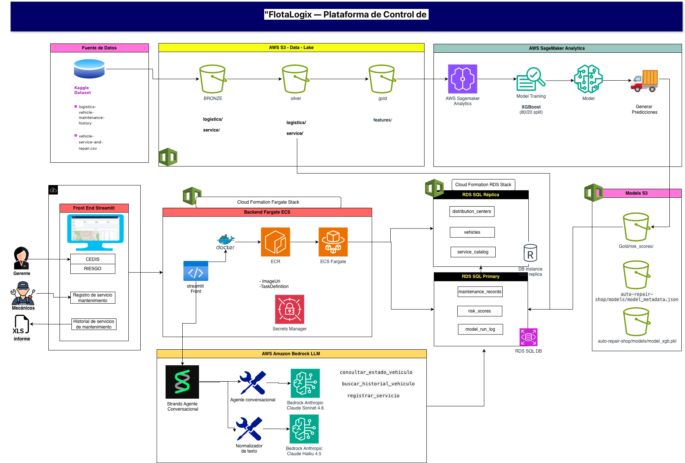

```{r setup, include=FALSE}
knitr::opts_chunk$set(echo = FALSE, message = FALSE, warning = FALSE)
```

\newpage

---

# FlotaLogix

Es una herramienta diseñada para talleres mecánicos especializados en el mantenimiento de flotas de transporte de carga pesada. La herramienta digitaliza el registro de reparaciones y aplica modelos de Machine Learning para anticipar qué vehículos de la flota atendida requieren servicio antes de que fallen transformando la operación del taller de reactiva a predictiva.

El sistema combina un pipeline de datos en la nube, un modelo de clasificación entrenado con variables operativas reales, un agente conversacional para guiar al mecánico, y un dashboard interactivo para el gerente del taller. 

**Usuario**

El cliente del producto es el **taller mecánico** que da servicio a grandes flotas logísticas. El usuario directo es el **mecánico o ayudante** que registra reparaciones en el día a día, y el **gerente del taller** que necesita visibilidad sobre el estado de la flota que atiende.

---

# 1. Tecnologías utilizadas

## 1.1 Infraestructura en la nube (AWS)

La aplicación corre sobre Amazon Web Services.

Los componentes de infraestructura son:

| Servicio                       | Rol en el sistema                                              |
| ------------------------------ | -------------------------------------------------------------- |
| **Amazon S3**                  | Data lake con arquitectura medallón (Bronze → Silver → Gold)   |
| **Amazon RDS — PostgreSQL 17** | Base de datos transaccional con réplica de lectura             |
| **Amazon SageMaker Studio**    | Entorno de ejecución de los notebooks del pipeline             |
| **Amazon ECS Fargate**         | Contenedor donde corre la aplicación Streamlit en producción   |
| **Amazon Bedrock**             | Modelo de lenguaje que alimenta al agente conversacional       |
| **AWS Secrets Manager**        | Almacenamiento seguro de credenciales de base de datos         |
| **AWS CloudFormation**         | Infraestructura como código para el stack `autoshop-rds` y ECS |

La infraestructura se aprovisiona de forma reproducible mediante dos templates de CloudFormation: `rds-autoshop.yaml` para la base de datos y `ecs-fargate-app.yaml` para la aplicación.

---

# 2. Uso de la aplicación

El sistema tiene dos capas de uso: el **pipeline de datos** que corre en la nube de forma periódica, y la **aplicación web** que usan el gerente y los mecánicos en el día a día.

## 2.1 Pipeline de datos

El pipeline está compuesto por cinco notebooks que se ejecutan en secuencia:

**00_data_generation : Generación de datos sintéticos**
Genera 5,000 vehículos con características realistas distribuidos en 6 talleres de la ZMVM. Utiliza una variable latente `health_score ~ Beta(2, 3)` para simular correlaciones no lineales entre condición operativa y probabilidad de falla. Este notebook se ejecuta una sola vez para inicializar el sistema con datos de arranque.

**01_etl : ETL (Extracción, Transformación, Carga)**
Lee los archivos CSV generados en el notebook anterior, valida rangos operativos (por ejemplo, `usage_hours` ∈ [0, 50,000] y `tire_pressure` ∈ [10, 100]), y escribe la capa **Silver** en formato Parquet en S3. Esta capa es la base limpia sobre la que opera el modelo.

**02_eda_features : EDA y Feature Engineering**
Construye dos variables derivadas clave que no existen en los datos originales:

- `days_since_maintenance`: días transcurridos desde el último servicio registrado.
- `load_ratio`: cociente entre la carga actual y la capacidad máxima del vehículo (`Actual_Load / Load_Capacity`).

El resultado se escribe en la capa **Gold**, lista para modelado.

**03_model : Entrenamiento del modelo y cálculo de scores**
Entrena el pipeline XGBoost con los datos Gold, evalúa el modelo contra el umbral de accuracy ≥ 0.75, y genera un score de riesgo (0–100) para cada uno de los 5,000 vehículos. El artefacto `model_xgb.pkl` y los scores se suben a S3.

**04_rds : Carga a RDS**
Inserta el catálogo de vehículos, los scores de riesgo y el catálogo de servicios en la base de datos PostgreSQL. 

## 2.2 Aplicación web

http://auto-repair-shop-alb-1836861376.us-east-1.elb.amazonaws.com/

La aplicación Streamlit tiene tres pestañas, cada una diseñada para un perfil de usuario distinto:

**Pestaña Gerente**
Vista de mando del taller. Muestra KPIs en tiempo real (flota total, vehículos en zona roja, costo acumulado de mantenimiento), un mapa interactivo con los CEDIS agrupados por nivel de riesgo, la lista de vehículos en zona roja ordenada por score, y dos gráficas: costo mensual acumulado y servicios más frecuentes. El gerente puede filtrar por centro de distribución y nivel de gravedad.

**Pestaña Mecánico**
Interfaz de registro guiado. Flujo conversacional de 7 pasos lleva al mecánico a capturar: placa del vehículo, tipo de servicio, descripción del trabajo, refacciones utilizadas, horas trabajadas, costo total y nombre del responsable. Cada dato ingresado aparece simultáneamente en un panel de resumen a la derecha. Al confirmar, el registro se guarda en `maintenance_records` en RDS y el score del vehículo se actualiza automáticamente.

**Pestaña Historial**
Permite consultar y filtrar el historial completo de servicios por placa, tipo de servicio y rango de fechas. Incluye KPIs de la selección (número de servicios, costo total, promedio por servicio, vehículos únicos) y un botón de descarga del reporte en CSV.

---

# 3. Adquisición y uso de datos

## 3.1 Fuentes de datos

El sistema parte de dos datasets públicos de Kaggle, complementados con datos sintéticos generados internamente:

**logistics-vehicle-maintenance-history**
https://www.kaggle.com/datasets/datasetengineer/logistics-vehicle-maintenance-history-dataset

92,000 registros de vehículos con 27 variables entre ellas: horas de uso, presión de llantas, consumo de combustible, condición de frenos, historial de fallas, anomalías detectadas, condiciones de ruta y clima, entre otras. Variable objetivo: `Maintenance_Required` (binaria). 


**vehicle-service-and-repair**
https://www.kaggle.com/datasets/neerugattivikram/vehicle-service-and-repair-dataset-for-analysis

Placas de vehículos, asignación a taller, variable `health_score ~ Beta(2,3)` como proxy de condición real.       


**Datos sintéticos**

Generación propia. Placas de vehículos, asignación a taller, variable `health_score ~ Beta(2,3)` como proxy de condición real.                                                                                                                                                                          |


## 3.2 Flujo de datos (arquitectura medallion)

Los datos atraviesan cuatro capas de procesamiento, cada una almacenada en S3:




## 3.3 Variables utilizadas por el modelo

El modelo de clasificación usa 16 variables seleccionadas explícitamente para evitar data leakage:

**Variables numéricas (10):** `Usage_Hours`, `Tire_Pressure`, `Fuel_Consumption`, `Battery_Status`, `Vibration_Levels`, `Failure_History`, `Anomalies_Detected`, `Delivery_Times`, `days_since_maintenance`, `load_ratio`.

**Variables categóricas (6):** `Vehicle_Type`, `Route_Info`, `Oil_Quality`, `Brake_Condition`, `Weather_Conditions`, `Road_Conditions`.

Variables excluidas por data leakage: `Predictive_Score`, `Maintenance_Cost`, `Downtime_Maintenance`, `Impact_on_Efficiency`. Estas variables se calculan después del evento de mantenimiento, por lo que su inclusión inflaría el desempeño del modelo.

## 3.4 Base de datos en producción

La base de datos PostgreSQL (RDS) tiene cinco tablas:

| Tabla                 | Contenido                                                                                             |
| --------------------- | ----------------------------------------------------------------------------------------------------- |
| `vehicles`            | Catálogo de vehículos con placa, modelo, año, tipo, ruta y taller asignado                            |
| `risk_scores`         | Score de riesgo actual por vehículo, nivel (Alto/Medio/Bajo) y timestamp del cálculo                  |
| `service_catalog`     | Catálogo estandarizado de problemas y soluciones aplicadas                                            |
| `maintenance_records` | Registro de cada servicio capturado: fecha, problema, solución, refacciones, costo y mecánico         |
| `model_run_log`       | Metadata de cada ejecución del pipeline: versión del modelo, accuracy, número de vehículos procesados |

Las escrituras van al host primario; las lecturas del dashboard y del agente van a la **réplica de lectura**, separando la carga operativa.

---

# 4. ¿Qué tipo de analítica o inteligencia se aplica?

El producto combina tres tipos de inteligencia:

## 4.1 Machine Learning supervisado — Clasificación binaria

Es un **pipeline scikit-learn + XGBoost** que predice si un vehículo requiere mantenimiento o no (`Maintenance_Required`: 1 / 0).

**Arquitectura del pipeline:**




**Parámetros de entrenamiento:**

- Semilla de aleatoriedad: `random_seed = 123` 
- Partición: 80% entrenamiento / 20% prueba
- Umbral de aprobación: accuracy ≥ 0.75 en el conjunto de prueba
- Resultado obtenido: **accuracy = 0.775**

El artefacto entrenado (`model_xgb.pkl`) se sube a S3 y el dashboard puede descargarlo para calcular un re-score on demand.

## 4.2 Modelado con variable latente (generación de datos sintéticos)

El dataset original de Kaggle incluye variables como `Anomalies_Detected` y `Failure_History` que, al inspeccionarse, no son variables operacionales independientes sino que fueron construidas en función de `Maintenance_Required`.







Vemos que son las únicas variables que tienen correlación con la variable objetivo y que la mayoría de sus covariables 

No se descartan como las variables que ocasionan data leakage ya que sí las tendríamos antes del target. Al correr el modelo con estos valores se tenía un accuracy prácticamente del 100%.

Para lograr ejemplificar cómo funcionaría el modelo con datos más apegados a la realidad, se decidió generar un dataset sintético donde todas las variables operacionales emergen de un factor latente no observable , el `health_score` que representa el estado de salud real del vehículo. Este score nunca se expone al modelo, solo guía la generación. Así, las correlaciones entre los features y el target son realistas y causalmente, pero ningún feature es una función directa de `Maintenance_Required`.






Para inicializar el sistema con datos estadísticamente válidos se utiliza un **modelo de variable latente**:

```
health_score ~ Beta(α=2, β=3)
```

La distribución Beta(2,3) está sesgada hacia valores bajos (mayor riesgo), lo que produce una distribución realista de condición vehicular donde la mayoría de los vehículos tienen algún grado de deterioro. Este score latente controla la probabilidad de que `Maintenance_Required = 1`, generando correlaciones no lineales naturales entre las variables operativas y la variable objetivo.

## 4.3 Agente conversacional con LLM (Amazon Bedrock — Anthropic)

El sistema incluye un **agente inteligente** para el mecánico, construido con el framework Strands Agents. Utiliza dos modelos de Anthropic vía Amazon Bedrock con roles distintos:

| Modelo | Uso |
|---|---|
| `claude-sonnet-4-6` | Cerebro del agente: razona, decide qué herramientas invocar y responde al mecánico |
| `claude-haiku-4-5` | Normalización de texto: detecta idioma, corrige ortografía y traduce al inglés antes de guardar en BD |

El agente tiene acceso a cinco herramientas:

| Herramienta | Función |
|---|---|
| `consultar_estado_vehiculo(placa)` | Consulta el score de riesgo, nivel y modelo del vehículo desde la réplica RDS |
| `buscar_historial_vehiculo(placa, n)` | Devuelve los últimos N servicios registrados para una unidad |
| `sugerir_refacciones(tipo_servicio)` | Sugiere las refacciones más comunes según el tipo de mantenimiento |
| `normalizar_descripcion(descripcion, tipo_servicio)` | Normaliza la descripción del mecánico antes de registrarla: corrige ortografía, detecta idioma y traduce al inglés si aplica |
| `registrar_servicio(...)` | Escribe un nuevo registro en `maintenance_records` en RDS primario |

El agente mantiene **memoria de conversación** dentro de la sesión, lo que le permite guiar al mecánico paso a paso sin perder el contexto entre preguntas. El sistema prompt instruye al agente a responder en español, de forma concisa y práctica, adaptado al ritmo de trabajo de un taller.

## 4.4 Analítica descriptiva

La pestaña Gerente del dashboard incluye:

- **Análisis de costo acumulado por mes** con gráfica de barras mensuales y línea de acumulado.
- **Frecuencia de servicios** para identificar qué tipos de mantenimiento son más recurrentes y costosos.
---

# 5. Inputs y outputs del producto

## 5.1 Inputs

| Input | Formato | Origen | Frecuencia |
|---|---|---|---|
| Dataset logístico de vehículos | CSV | Kaggle | Una vez / re-entrenamiento |
| Dataset de servicios y reparaciones | CSV | Kaggle | Una vez / actualización |
| Datos sintéticos de flota | Generados en NB00 | Código interno | Inicialización |
| Archivo de configuración | `config.yaml` | Repositorio | Al cambiar parámetros |
| Credenciales de base de datos | JSON | AWS Secrets Manager | En tiempo de ejecución |
| Registro de servicio (mecánico) | Formulario web | Pestaña Mecánico | Por cada servicio realizado |
| Consulta del agente (texto libre) | Chat | Pestaña del agente | Por cada interacción |

## 5.2 Outputs

| Output                      | Formato             | Destino                         | Descripción                                 |
| --------------------------- | ------------------- | ------------------------------- | ------------------------------------------- |
| Datos Bronze                | CSV (sin modificar) | S3 `bronze/`                    | Copia fiel de las fuentes originales        |
| Datos Silver                | Parquet             | S3 `silver/`                    | Datos limpios y validados                   |
| Datos Gold                  | Parquet             | S3 `gold/`                      | Features finales listos para modelado       |
| Scores de riesgo            | Parquet             | S3 `gold/risk_scores/`          | Score 0–100 y etiqueta binaria por vehículo |
| Modelo entrenado            | `.pkl` (joblib)     | S3 `models/model_xgb.pkl`       | Pipeline serializado para re-inferencia     |
| Metadata del modelo         | JSON                | S3 `models/model_metadata.json` | Versión, accuracy, fecha, features usados   |
| Tabla `vehicles`            | PostgreSQL          | RDS                             | Catálogo maestro de unidades                |
| Tabla `risk_scores`         | PostgreSQL          | RDS                             | Scores consultables por la app              |
| Tabla `maintenance_records` | PostgreSQL          | RDS                             | Registro de cada servicio capturado         |
| Tabla `model_run_log`       | PostgreSQL          | RDS                             | Trazabilidad de ejecuciones del pipeline    |
| Dashboard interactivo       | Aplicación web      | Streamlit / ECS Fargate         | Visualización en tiempo real                |
| Reporte de historial        | CSV descargable     | Navegador del usuario           | Exportación de servicios filtrados          |
| Respuesta del agente        | Texto               | Chat en la app                  | Guía al mecánico                            |

---

# 6. ¿Cómo consume el usuario final los outputs?

## 6.1 El Gerente del Taller

El gerente accede al sistema a través de la **Pestaña Gerente** en la aplicación web. 

Al abrir la aplicación, se muestra: total de vehículos en la flota atendida, cuántos están en zona roja (riesgo Alto), cuántos están disponibles sin mantenimiento pendiente, cuántos requieren servicio y el costo acumulado total de mantenimiento.

También cuenta con un mapa interactivo que muestra los talleres con un marcador de semáforo en función del riesgo promedio de sus unidades. Al pasar el cursor sobre un marcador, aparece el nombre del CEDIS, la cantidad de vehículos asignados y cuántos están en zona roja. Puede filtrar por taller y nivel de riesgo.





También aparece la  **lista de vehículos en zona roja**, ordenada por score de mayor a menor, con placa, modelo, taller y modelo de la unidad.

En la parte inferior cuenta con información sobre gastos reparación y trabajos más comunes.

En general se brinda información para poder optimizar su operación, desde necesidades de inventario (con la gráfica de reparaciones más comunes) hasta concentración de la fuerza de trabajo al ver dónde se requiere mayor número de mecánicos para las unidades de alto riesgo.

## 6.2 El Mecánico

El mecánico accede a la **Pestaña Mecánico**. El sistema lo guía con un flujo de 7 preguntas, una a la vez, en formato de chat:

1. Selecciona la placa del vehículo que ingresa al taller.
2. Selecciona el tipo de servicio que presenta la unidad.
3. Escribe una descripción del trabajo realizado.
4. Selecciona las refacciones utilizadas del catálogo estandarizado (selección múltiple).
5. Indica las horas de trabajo.
6. Captura el costo total del servicio en MXN.
7. Selecciona el nombre del mecánico responsable.

Mientras responde cada pregunta, un panel a la derecha muestra en tiempo real el resumen del registro que se está construyendo. Al completar los 7 pasos, el sistema llama automáticamente a **Claude Haiku** para normalizar la descripción: detecta el idioma, corrige errores ortográficos y traduce al inglés si el mecánico escribió en español. El resultado se muestra al mecánico antes de confirmar. Al confirmar, el registro se guarda en `maintenance_records` con la descripción estandarizada.





## 6.3 Historial y los Reportes

Cualquier usuario del taller puede acceder a la **Pestaña Historial** para consultar el registro completo de servicios. Los filtros disponibles son: placa, tipo de servicio, fecha de inicio y fecha de fin. La tabla resultante muestra fecha, servicio, solución aplicada, costo y notas del mecánico. Un botón de descarga genera un CSV con los registros filtrados, listo para compartir con el cliente flota o para análisis interno.




---

# 7. Costo anual

El costo anual está calculado para un escenario con  **6 talleres activos, 2 usuarios recurrentes por taller (12 usuarios totales)**, atendiendo una flota total de 5,000 vehículos. 

## 7.1 Desglose de infraestructura AWS

| Componente             | Servicio                       | Especificación                                              | Costo mensual | Costo anual |
| ---------------------- | ------------------------------ | ----------------------------------------------------------- | ------------- | ----------- |
| Base de datos primaria | RDS PostgreSQL 17              | `db.t3.micro`, 20 GB gp3, Single-AZ                         | $17.00        | ~$204       |
| Réplica de lectura     | RDS Read Replica               | `db.t3.micro`, misma región                                 | $17.00        | ~$204       |
| Data lake              | S3 Standard                    | ~8 GB (Bronze + Silver + Gold + modelos, 6 talleres)        | $0.30         | ~$3.60      |
| Credenciales           | Secrets Manager                | 1 secret compartido activo                                  | $0.40         | $4.80       |
| Pipeline de datos      | SageMaker Studio               | `ml.t3.medium`, ~20 h/mes (NB00–NB04)                       | $1.20         | ~$14.40     |
| Aplicación web         | ECS Fargate                    | `0.5 vCPU / 1 GB RAM`, 730 h/mes (12 usuarios concurrentes) | $18.00        | ~$216.00    |
| Bedrock — Claude Sonnet 4.6 | Amazon Bedrock | ~2,500 consultas/mes del agente (6 talleres × 2 usuarios) | $10.00 | ~$120.00 |
| Bedrock — Claude Haiku 4.5 | Amazon Bedrock | ~1,320 normalizaciones/mes (10 registros/día × 22 días × 6 talleres) | $0.61 | ~$7.30 |
| **Total estimado**     |                                |                                                             | **$65**       | **$775**    |
Costos aproximados en dólares.

## 7.3 Costo por taller

| Concepto                                                    | Costo mensual | Costo anual |
| ----------------------------------------------------------- | ------------- | ----------- |
| Infraestructura compartida (RDS + S3 + SageMaker + Secrets) | $19           | $228       |
| Aplicación web (ECS Fargate)                                | $18           | $216       |
| Bedrock — porción por taller (2,500 consultas / 6)          | $1.67         | $20        |
| **Costo por taller**                                        | **$6.30**     | **$77 **    |
| **Costo total (6 talleres)**                                | **$64 **      | **$770**    |

El costo por taller resulta especialmente bajo porque la infraestructura de datos (RDS, S3, SageMaker) es compartida: escalar de 1 a 6 talleres no multiplica los costos fijos por 6, sino que los distribuye.

---

# 8. Limitaciones y siguientes pasos

**La aplicación requiere conexión a internet permanente**
La aplicación web y el agente requieren conexión para consultar RDS y Bedrock. El pipeline de datos requiere acceso a S3 y SageMaker durante su ejecución. No hay componentes que operen offline.

Como siguiente paso para la evolución del producto, la interfaz de registro para el mecánico migraría de la aplicación Streamlit a un **chatbot dentro de WhatsApp**. 

Esta migración reduciría aún más la fricción de abrir una aplicación web y permitiría al mecánico registrar servicios, consultar el estado de un vehículo y recibir sugerencias de refacciones directamente desde su celular, sin instalar nada adicional. El agente conversacional ya está construido con esta lógica de interacción en mente.


# 9. Uso de herramientas de IA en el proyecto 

En este proyecto se utilizaron herramientas de IA como apoyo puntual en tareas de diseño, depuración y documentación. Las herramientas principales fueron GitHub Copilot y Claude CLI, utilizando modelos como Claude Sonnet y Claude Opus. La implementación final, decisiones de arquitectura y validación de resultados fueron responsabilidad del equipo.

| Área | Uso | Herramienta / modelo |
|---|---|---|
| Generación de datos sintéticos (notebook 0) | Apoyo en el diseño del mecanismo de variable latente `health_score ~ Beta(2,3)` y la lógica de correlación con variables operacionales | Claude CLI (Claude Sonnet / Claude Opus) |
| Logs del pipeline | Integración del registro por etapa para reportar descripciones, tiempos de ejecución y conteos de registros procesados | GitHub Copilot (Claude Sonnet) |
| Diseño de datos mockeados | Definición de estructuras y reglas de datos sintéticos para desacoplar el frontend de Streamlit de la capa de persistencia durante desarrollo y pruebas | GitHub Copilot (Claude Sonnet) |
| Interacción visual tipo chat en Streamlit | Apoyo en el diseño del esqueleto visual (layout, componentes y estilos CSS) para exponer la lógica del agente; la implementación final, ajustes funcionales e integración quedaron a cargo del equipo | GitHub Copilot (Claude Sonnet / Claude Opus) |
| Estructura del chatbot (agente + frontend) | Apoyo parcial en la definición de la estructura modular del chatbot, organización de componentes e integración entre la lógica del agente y la interfaz en Streamlit | GitHub Copilot y Claude CLI (Claude Sonnet / Claude Opus) |
| Búsqueda de errores de configuración | Apoyo para identificar y corregir errores de configuración en Makefile, dependencias, despliegue ECS/Fargate y conexión a RDS | GitHub Copilot (Claude Sonnet / Claude Opus) |
| Dudas técnicas y documentación AWS | Apoyo para resolver dudas técnicas y consultar buenas prácticas de servicios AWS (IAM, ECS/Fargate, RDS, CloudFormation y networking) durante el desarrollo y despliegue | GitHub Copilot y Claude CLI (Claude Sonnet / Claude Opus) |
| Revisión de queries SQL | Revisión de consultas para carga inicial de `service_catalog` y lectura de `risk_scores` desde la réplica de lectura | GitHub Copilot (Claude Sonnet) |
| Documentación | Generación del esqueleto de FAQ y README | Claude CLI |
| Docstrings de métodos | Apoyo en la redacción y mejora de docstrings para describir propósito, parámetros, retornos y errores esperados | GitHub Copilot (Claude Sonnet) |
| Diagramas Mermaid notebook 04 | Generación de los diagramas de arquitectura y ERD en formato Mermaid | Claude CLI |
| Simulación de operaciones CRUD | Simulación de operaciones CRUD en maintenance_records notebook 04 | Claude CLI |


# 10. Diagrama de arquitectura general del sistema




