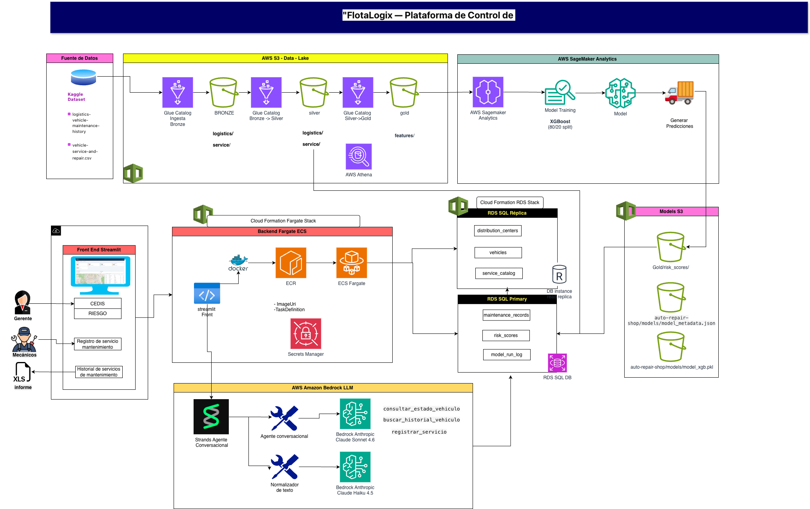

# ITAM Maestría en Ciencia de Datos — Arquitectura de Productos de Datos

## Autores

- **Blanca Azucena Orduña López**
- **Daniel Miranda Badillo**

**Repositorio:** https://github.com/azu-ord/proyecto_final_arquitectura

**URL aplicación:**http://auto-repair-shop-alb-1836861376.us-east-1.elb.amazonaws.com/

---

## Descripción del Proyecto

FlotaLogix es una herramienta digital diseñada para talleres mecánicos especializados en el mantenimiento de flotas de transporte de carga. El sistema digitaliza el registro de reparaciones y aplica modelos de Machine Learning para anticipar qué vehículos requieren servicio antes de que fallen, transformando la operación del taller de reactiva a predictiva.

### Caso de uso

Un taller mecánico atiende una flota de cientos o miles de unidades. Actualmente registra sus reparaciones en papel o Excel, sin visibilidad del estado real de cada vehículo. FlotaLogix centraliza el historial de servicios, calcula un score de riesgo por unidad y guía al mecánico en el registro con un flujo conversacional.

### Objetivo

Desarrollar un producto de datos end-to-end que permita:

- **Ingesta y transformación** de datos de mantenimiento vehicular con arquitectura medallion en S3
- **Clasificación binaria** de riesgo de mantenimiento con XGBoost (accuracy ≥ 0.775)
- **Agente conversacional** para mecánicos con LLM (Claude Sonnet via Amazon Bedrock)
- **Dashboard interactivo** para el gerente del taller con KPIs, mapa de riesgo e historial

### Datos

- **Fuente primaria:** Kaggle — [logistics-vehicle-maintenance-history](https://www.kaggle.com/datasets/datasetengineer/logistics-vehicle-maintenance-history-dataset)
- **Fuente secundaria:** Kaggle — [vehicle-service-and-repair](https://www.kaggle.com/datasets/neerugattivikram/vehicle-service-and-repair-dataset-for-analysis)
- **Datos sintéticos:** 5,000 vehículos generados con variable latente.

- **Métrica de desempeño del modelo:**
  - **Accuracy XGBoost: 0.775 — sobre umbral de aprobación de 0.75**

---

## Arquitectura del proyecto





### Pipeline de notebooks (ejecutar en orden)

| Notebook | Nombre | Descripción |
|---|---|---|
| `00` | `00_data_generation` | Genera 5,000 vehículos sintéticos con `health_score ~ Beta(2,3)` distribuidos en 6 talleres |
| `01` | `01_etl` | Valida rangos operativos y escribe capa Silver en Parquet |
| `02` | `02_eda_features` | Feature engineering: `days_since_maintenance`, `load_ratio` a capa Gold |
| `03` | `03_model` | Entrena XGBoost, evalúa contra umbral 0.75, genera scores 0–100 por vehículo |
| `04` | `04_rds` | Carga vehículos, scores y catálogo de servicios en RDS PostgreSQL |

### Variables utilizadas por el modelo

| Feature | Tipo | Descripción |
|---|---|---|
| `Usage_Hours` | Numérica | Horas de operación acumuladas |
| `Tire_Pressure` | Numérica | Presión de llantas (PSI) |
| `Fuel_Consumption` | Numérica | Consumo de combustible |
| `Battery_Status` | Numérica | Estado de la batería |
| `Vibration_Levels` | Numérica | Nivel de vibración del motor |
| `Failure_History` | Numérica | Historial de fallas previas |
| `Anomalies_Detected` | Numérica | Anomalías detectadas por sensores |
| `Delivery_Times` | Numérica | Tiempos de entrega registrados |
| `days_since_maintenance` | Numérica (generada) | Días desde el último servicio |
| `load_ratio` | Numérica (generada) | Cociente carga actual / capacidad máxima |
| `Vehicle_Type` | Categórica | Tipo de vehículo (Truck, Van, Sub, Bus) |
| `Route_Info` | Categórica | Tipo de ruta |
| `Oil_Quality` | Categórica | Calidad del aceite |
| `Brake_Condition` | Categórica | Condición de frenos |
| `Weather_Conditions` | Categórica | Condiciones climáticas de operación |
| `Road_Conditions` | Categórica | Condiciones de la vía |

> Variables excluidas por data leakage: `Predictive_Score`, `Maintenance_Cost`, `Downtime_Maintenance`, `Impact_on_Efficiency`. Se calculan después del evento de mantenimiento.

### Splits del modelo

| Split | Proporción | Uso |
|---|---|---|
| Train | 80% | Entrenamiento del pipeline XGBoost |
| Test | 20% | Evaluación contra umbral accuracy ≥ 0.75 |

---

## Aplicación Desplegada

| | |
|---|---|
| **URL pública** | http://auto-repair-shop-alb-1836861376.us-east-1.elb.amazonaws.com/ |
| **Plataforma** | AWS ECS Fargate |
| **Región** | us-east-1 |
| **Stack** | `autoshop-rds` · `autoshop-ecs-app` |

---

## Arquitectura de la Solución

El sistema se divide en dos capas:

**Capa de datos y ML (datos de modelo precargados):**
- Datos de Kaggle ingestados a **S3 Bronze** como CSV
- Transformación Bronze → Silver → Gold con notebooks en **SageMaker Studio**
- Feature engineering sobre variables operativas reales
- Entrenamiento de pipeline **XGBoost + sklearn**
- Scores de riesgo (0–100) y modelo serializado almacenados en **S3 Gold**

**Capa de serving (online):**
- Tablas operacionales cargadas en **RDS PostgreSQL** con réplica de lectura
- Réplica de lectura para separar el tráfico del dashboard y del agente del tráfico de escrituras del mecánico
- **Agente conversacional** con Strands Agents + `claude-sonnet-4-6` via **Amazon Bedrock**
- Aplicación **Streamlit** containerizada en Docker, desplegada en **ECS Fargate** con CloudFormation
- Credenciales gestionadas con **AWS Secrets Manager**

---

## Modelo de Datos

### Tablas en RDS PostgreSQL

| Tabla | Propósito | Escribe | Consume |
|---|---|---|---|
| `vehicles` | Catálogo de vehículos con placa, modelo, año, tipo y taller | ETL (notebook 04) | App - búsqueda por placa |
| `risk_scores` | Score 0–100 y nivel de riesgo (Alto/Medio/Bajo) por vehículo | ETL (notebook 04) | App - dashboard |
| `service_catalog` | Catálogo estandarizado de problemas y soluciones | ETL (NB04) | App — mecánico y agente |
| `maintenance_records` | Registro de cada servicio: fecha, problema, solución, refacciones, costo, mecánico | App (escritura) | App - historial |
| `model_run_log` | Metadata de cada ejecución: versión, accuracy, features, timestamp | ETL (NB03) | Trazabilidad |

Las escrituras van al host primario, las lecturas del dashboard y del agente van a la **réplica de lectura**.

---

## Tour de la Aplicación

### Pestaña Gerente
Vista de mando del taller. Muestra KPIs en tiempo real (flota total, vehículos en zona roja, costo acumulado), mapa interactivo con semáforo de riesgo por taller, lista de unidades críticas ordenada por score, y gráficas de costo mensual acumulado y servicios más frecuentes.


### Pestaña Mecánico
Flujo guiado de 7 pasos: placa → tipo de servicio → descripción → refacciones → horas → costo → mecánico responsable. Un panel de resumen a la derecha se actualiza en tiempo real. Al confirmar, el registro se guarda en `maintenance_records` y el score del vehículo se actualiza.

### Agente Conversacional
El mecánico puede consultar el estado de una unidad por placa, pedir sugerencias de refacciones para un tipo de servicio o registrar un servicio en lenguaje natural. El agente mantiene contexto durante toda la sesión y responde en español.


### Pestaña Historial
Filtros por placa, tipo de servicio y rango de fechas. Tabla con KPIs de la selección y botón de descarga en CSV — el mismo reporte que el taller entrega a su cliente flota.


---

## Recursos AWS Desplegados

| Servicio | Recurso | Rol |
|---|---|---|
| **Amazon S3** | `itam-final-usuario` | Data lake Bronze / Silver / Gold / modelos |
| **Amazon RDS** | `autoshop-db` (db.t3.micro) | Base de datos transaccional |
| **RDS Read Replica** | `autoshop-db-replica` | Lectura para dashboard y agente |
| **Amazon SageMaker Studio** | `ml.t3.medium` | Ejecución de notebooks 00-04 |
| **Amazon ECS Fargate** | `autoshop-service` | Contenedor Streamlit |
| **Amazon Bedrock** | `claude-sonnet-4-6` | LLM del agente conversacional |
| **AWS Secrets Manager** | `autoshop/rds` | Credenciales de base de datos |
| **AWS CloudFormation** | `autoshop-rds` · `autoshop-ecs-app` | Infraestructura como código |

---

## Estimación de Costos

Escenario: **6 talleres activos, 2 usuarios recurrentes por taller (12 usuarios totales)**, flota de 5,000 vehículos, región `us-east-1`.

| Servicio | Configuración | Costo est./mes (USD) |
|---|---|---|
| RDS PostgreSQL 17 primaria | db.t3.micro, 20 GB gp3, Single-AZ | ~$17 |
| RDS Read Replica | db.t3.micro, misma región | ~$17 |
| ECS Fargate (Streamlit) | 0.5 vCPU / 1 GB RAM, 730 h/mes | ~$18 |
| Amazon Bedrock (Claude Sonnet) | ~2,500 consultas/mes (6 talleres × 2 usuarios) | ~$10 |
| SageMaker Studio | ml.t3.medium, ~20 h/mes (NB00–NB04) | ~$1.20 |
| Amazon S3 + API requests | ~8 GB Bronze/Silver/Gold + modelos | ~$0.30 |
| AWS Secrets Manager | 1 secret compartido | $0.40 |
| **TOTAL estimado** | | **$64 / mes · $768 / año** |
| **Costo por taller** | Infraestructura compartida | **$6.30 / taller / mes** |

---

## Limitaciones y Próximos Pasos

**Limitaciones del MVP:**
- La aplicación requiere conexión a internet permanente, no hay componentes offline
- Los scores se recalculan al ejecutar el pipeline, no en tiempo real por evento
- No hay autenticación de usuarios, cualquier persona con la URL puede acceder


**Próximos pasos:**
- Migrar la interfaz del mecánico de Streamlit a un **chatbot de WhatsApp** (WhatsApp Business API).
- Implementar reentrenamiento automático mensual del modelo XGBoost
- Agregar autenticación por taller (Cognito o token por URL)
- Monitoreo de drift del modelo con CloudWatch + alertas SNS

---

## Estructura del Repositorio

```
proyecto_final_arquitectura/
│
├── agent/                        # Agente conversacional para mecánicos (Strands)
│   ├── agent.py                  # Construcción del agente (Claude Sonnet 4.6)
│   ├── normalizer.py             # Normalización de texto vía Bedrock (Claude Haiku 4.5)
│   ├── prompts.py                # System prompt del agente
│   └── tools.py                  # Tools: consultar_estado_vehiculo, buscar_historial,
│                                 #        sugerir_refacciones, registrar_servicio
│
├── frontend/                     # Aplicación Streamlit
│   ├── app.py                    # Punto de entrada de la app
│   ├── config.py                 # Configuración de la UI
│   ├── db.py                     # Conexión a RDS Réplica (lecturas del gerente)
│   └── mock_data.py              # Datos de prueba para desarrollo local
│
├── notebooks/                    # Pipeline de datos y modelado
│   ├── 00_data_generation.ipynb  # Generación y exploración inicial de datos
│   ├── 01_etl.ipynb              # ETL: CSVs → S3 Bronze → S3 Silver
│   ├── 02_eda_features.ipynb     # EDA + Feature Engineering → S3 Gold (features/)
│   ├── 03_model.ipynb            # Entrenamiento XGBoost → S3 Gold (risk_scores/) + models/
│   └── 04_rds.ipynb              # Carga de Gold/Silver → RDS PostgreSQL
│
├── infra/                        # Infraestructura como código (CloudFormation)
│   ├── ecs-fargate-app.yaml      # Stack de ECS Fargate + ECR
│   ├── rds-autoshop.yaml         # Stack de RDS Primary + Réplica de lectura
│   └── build_ecs.sh              # Script de build y push de imagen Docker
│
├── data/
│   └── raw/                      # CSVs originales de Kaggle (no se suben a S3)
│       ├── logistics_dataset_with_maintenance_required.csv
│       └── services_and_repair.csv
│
├── config.yaml                   # Configuración central (bucket, paths S3, RDS, modelo)
├── Dockerfile                    # Imagen Docker de la app Streamlit + agente
├── Makefile                      # Comandos comunes (build, deploy, run local)
├── requirements.txt              # Dependencias de notebooks
└── requirements-app.txt          # Dependencias de la app (Streamlit + agente)
```

---

## Uso de Herramientas de IA en el Proyecto

En este proyecto se utilizaron herramientas de IA como apoyo puntual en tareas de diseño, depuración y documentación. Las herramientas principales fueron GitHub Copilot y Claude CLI, utilizando modelos como Claude Sonnet y Claude Opus. La implementación final, decisiones de arquitectura y validación de resultados fueron responsabilidad del equipo.

| Área | Uso | Herramienta / modelo |
|---|---|---|
| Generación de datos sintéticos (notebook 0) | Apoyo en el diseño del mecanismo de variable latente `health_score ~ Beta(2,3)` y la lógica de correlación con variables operacionales | Claude CLI (Claude Sonnet / Claude Opus) |
| Logs del pipeline | Integración del registro por etapa para reportar descripciones, tiempos de ejecución y conteos de registros procesados | GitHub Copilot (Claude Sonnet) |
| Diseño de datos mockeados | Definición de estructuras y reglas de datos sintéticos para desacoplar el frontend de Streamlit de la capa de persistencia durante desarrollo y pruebas | GitHub Copilot (Claude Sonnet) |
| Interacción visual tipo chat en Streamlit | Apoyo en el diseño del esqueleto visual (layout, componentes y estilos CSS) para exponer la lógica del agente; la implementación final, ajustes funcionales e integración quedaron a cargo del equipo | GitHub Copilot (Claude Sonnet / Claude Opus) |
| Estructura del chatbot (agente + frontend) | Apoyo parcial en la definición de la estructura modular del chatbot, organización de componentes e integración entre la lógica del agente y la interfaz en Streamlit | GitHub Copilot y Claude CLI (Claude Sonnet / Claude Opus) |
| Búsqueda de errores de configuración | Apoyo para identificar y corregir errores de configuración en Makefile, dependencias, despliegue ECS/Fargate y conexión a RDS | GitHub Copilot (Claude Sonnet / Claude Opus) |
| Dudas técnicas y documentación AWS | Apoyo para resolver dudas técnicas y consultar buenas prácticas de servicios AWS (IAM, ECS/Fargate, RDS, CloudFormation y networking) durante el desarrollo y despliegue | GitHub Copilot y Claude CLI (Claude Sonnet / Claude Opus) |
| Revisión de queries SQL | Revisión de consultas para carga inicial de `service_catalog` y lectura de `risk_scores` desde la réplica de lectura | GitHub Copilot (Claude Sonnet) |
| Documentación | Generación del esqueleto de FAQ y README | Claude CLI |
| Docstrings de métodos | Apoyo en la redacción y mejora de docstrings para describir propósito, parámetros, retornos y errores esperados | GitHub Copilot (Claude Sonnet) |
| Diagramas Mermaid notebook 04 | Generación de los diagramas de arquitectura y ERD en formato Mermaid | Claude CLI |
| Simulación de operaciones CRUD | Simulación de operaciones CRUD en maintenance_records notebook 04 | Claude CLI |
---

## Configuración Local

### Prerrequisitos

- Python 3.11
- Docker Desktop corriendo
- AWS CLI (`pip install awscli`)
- Cuenta AWS con acceso a S3, RDS, SageMaker, Bedrock, ECS y Secrets Manager

### 1. Credenciales AWS

```bash
aws configure
# Access Key ID, Secret Access Key, región: us-east-1
aws sts get-caller-identity  # verificar
```

### 2. Variables de entorno

Crear archivo `.env` en la raíz (ya está en `.gitignore`):

```bash
DB_HOST_PRIMARY=<endpoint-rds-primary>
DB_HOST_REPLICA=<endpoint-rds-replica>
DB_NAME=autoshop_db
DB_USER=itam
DB_PASSWORD=<password>
SECRET_ARN=<arn-secrets-manager>
AWS_REGION=us-east-1
S3_BUCKET=itam-final-azucena
```

Los valores de `DB_HOST_PRIMARY`, `DB_HOST_REPLICA` y `SECRET_ARN` se obtienen de los outputs del stack CloudFormation `autoshop-rds`.

### 3. Ejecutar el pipeline de datos y ML

```bash
# En SageMaker Studio (ejecutar en orden):
notebooks/00_data_generation.ipynb
notebooks/01_etl.ipynb
notebooks/02_eda_features.ipynb
notebooks/03_model.ipynb

# Desplegar RDS (CloudFormation):
aws cloudformation deploy \
  --template-file infra/rds-autoshop.yaml \
  --stack-name autoshop-rds \
  --capabilities CAPABILITY_NAMED_IAM \
  --parameter-overrides \
      VpcId=<vpc-id> \
      SubnetIds="<subnet-1>,<subnet-2>" \
      DBPassword=<password>

# Cargar RDS:
notebooks/04_rds.ipynb
```

### 4. Instalar dependencias

```bash
pip install -r requirements.txt
```

### 5. Correr la app en local

```bash
streamlit run frontend/app.py
```

Levanta la app en `http://localhost:8501`. Requiere conectividad a RDS y las variables del `.env`.

### 6. Correr la app en contenedor Docker (local)

```bash
# Construir imagen
docker build -t autoshop-app:latest .

# Ejecutar contenedor
docker run --env-file .env \
  -v ~/.aws:/root/.aws:ro \
  -p 8501:8501 \
  autoshop-app:latest
```

---

## Despliegue en AWS

### Primera vez

**Paso 1 — Desplegar RDS:**

```bash
aws cloudformation deploy \
  --template-file infra/rds-autoshop.yaml \
  --stack-name autoshop-rds \
  --capabilities CAPABILITY_NAMED_IAM \
  --parameter-overrides \
      VpcId=<vpc-id> \
      SubnetIds="<subnet-1>,<subnet-2>" \
      DBPassword=<password>
```

Tomar los outputs del stack y llenar el `.env`.

**Paso 2 — Desplegar la app en ECS Fargate:**

```bash
aws cloudformation deploy \
  --template-file infra/ecs-fargate-app.yaml \
  --stack-name autoshop-ecs-app \
  --capabilities CAPABILITY_NAMED_IAM \
  --parameter-overrides \
      SecretArn=<secret-arn> \
      VpcId=<vpc-id> \
      SubnetIds="<subnet-1>,<subnet-2>"
```

**Paso 3 — Conectar ECS con RDS** (solo la primera vez): autorizar el security group de ECS para acceder al puerto 5432 de RDS.

### Diagnóstico

```bash
# Ver eventos del servicio ECS
aws ecs describe-services \
  --cluster autoshop-cluster \
  --services autoshop-service \
  --region us-east-1 \
  --query 'services[0].events[:10]'

# Ver logs del contenedor
aws logs tail /ecs/autoshop --follow --region us-east-1
```
